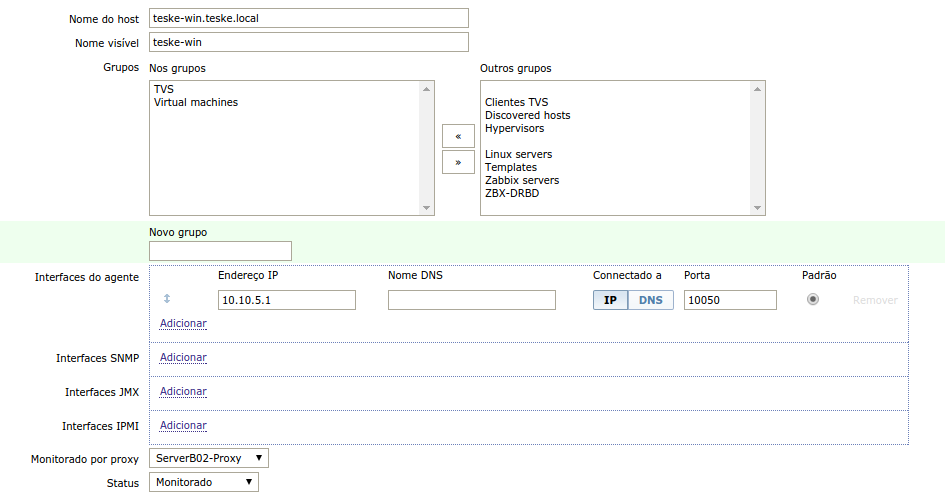

# Copiando configurações de um Host já criado

Caso já exista um host com configurações similares criado, você poderá `Clonar` ele ao invés de criar um novo. Para isso selecione o host que deseja clonar na lista de hosts.

Clicando no nome, a tela de configurações do host irá abrir. Feito isso clique no botão 

Feito isso, edite o `Nome do Host`, `Nome visível` e `IP` e clique em `Salvar`

