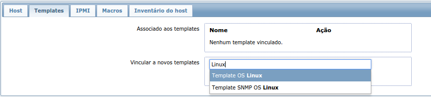
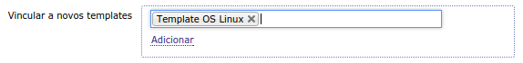
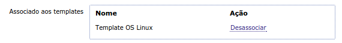

# Criando Host

O primeiro passo para se criar o host é ir no `Menu Superior` -> `Configurações` e clicar em `Hosts`.

Feito isso, uma lista de hosts criados irá aparecer. No canto superior direito há um botão 

Neste tela, preencha os campos da seguinte maneira:

| Campo | Descrição | Exemplo |
|-------|-----------|---------|
|Nome do Host| Este é o nome que será especificado no arquivo de configuração do agente. Ele deverá ser único. | minha-nova-maquina |
|Nome visível| Este é o nome que irá aparecer nos relatórios e em qualquer seção do Zabbix. Use um nome fácil de reconhecer.| Minha nova máquina |
| Grupos | Aqui você poderá selecionar grupos existentes para associar este host. Use para organizar. | Clientes |
| Interfaces do Agente: IP| Este é o endereço de IP da máquina alvo. Ele precisa ser um IP acessível pela internet ou acessível pelo Proxy | 10.0.5.1 |
|Monitorado por Proxy| Selecione aqui o Proxy que irá monitorar a máquina caso ela não esteja direto ná internet. | Proxy do Cliente |

Feito isso, clique no menu logo abaixo de `Configuração de Hosts` na opção `Templates`. Aqui selecionaremos os templates a serem usados para este host.

Escreva uma parte do nome do template no campo `Vincular a novos templates`. Por exemplo se a máquina for Linux, escreva `Linux`. Um popup deve aparecer com a lista de templates que tenham a palavra pesquisada.

Clique no template desejado e ele ficará marcado. Após isso clique em adicionar.

Feito isso o(s) template(s) estarão associados ao host que será criado.

Esses templates definirão os dados a serem coletados do host.

Após terminar as configurações clique em 