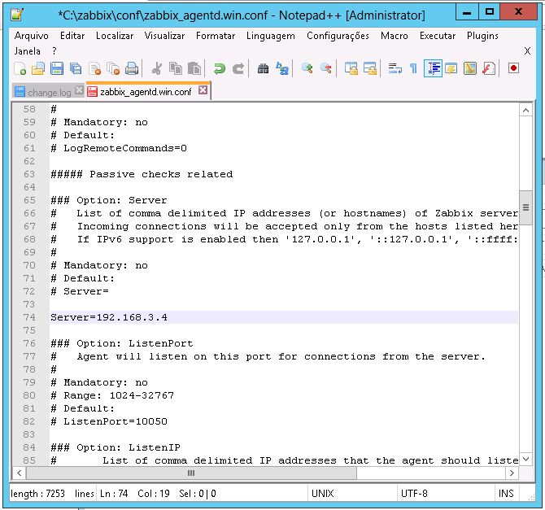
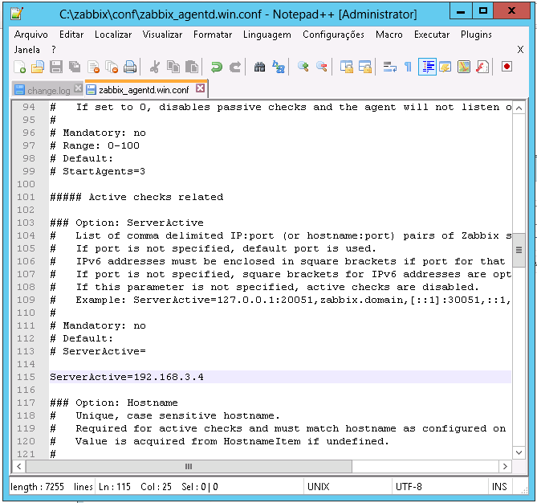
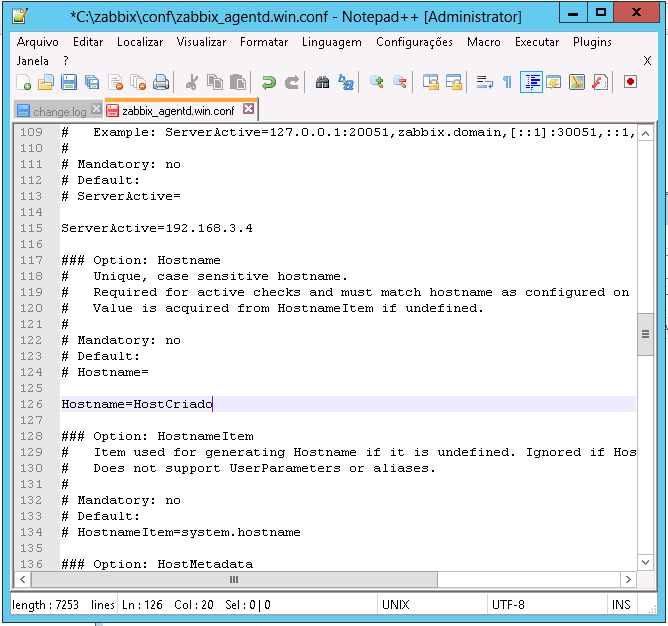

# Configurando Agente Zabbix

Para configurar o Zabbix Agent vamos abrir o arquivo `C:\zabbix\conf\zabbix_agentd.win.conf` e editar as seguintes linhas:

```
Server={IP DO SEU SERVIDOR/PROXY}
ServerActive={IP DO SEU SERVIDOR/PROXY}
Hostname={NOME DO HOST CRIADO NO ZABBIX}
```





Certifique-se de que os endereços para o Servidor / Proxy estão corretos e que o nome do Hostname bate com o criado no servidor Zabbix.