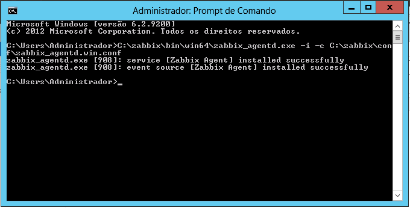

# Instalando Agente como Serviço

Para se instalar o agente como serviço deve-se abrir o `Prompt de Comando` como Administrador. Para isso vá ao `Menu Iniciar` e procure por `Prompt de Comando` ou `cmd` e clique com o botão direito em cima e vá em `Executar como Administrador`.


Feito isso, execute o seguinte comando:

```
C:\zabbix\bin\win64\zabbix_agentd.exe -i -c C:\zabbix\conf\zabbix_agentd.win.conf
```



Feito isso, o agente deve estar instalado como serviço.


Porém antes de inicia-lo, é necessário liberar os acessos no firewall do windows.