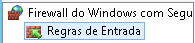
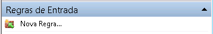
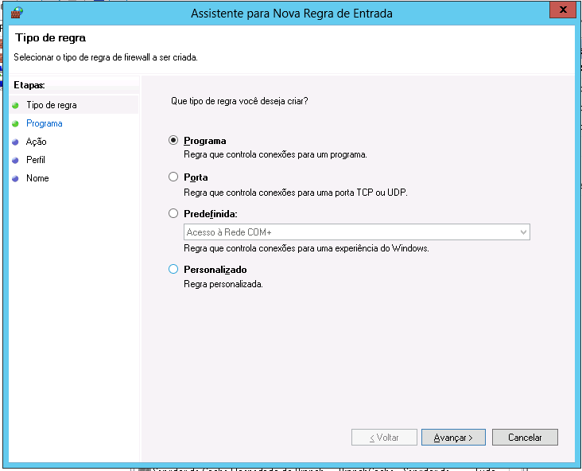
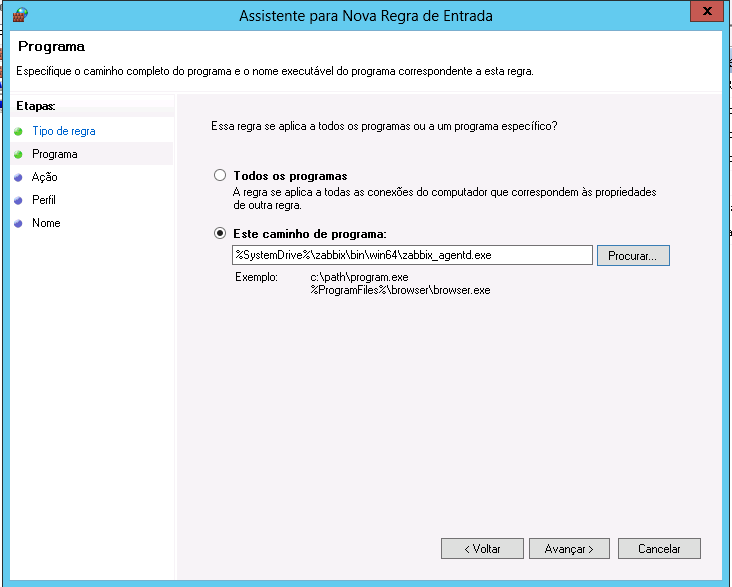
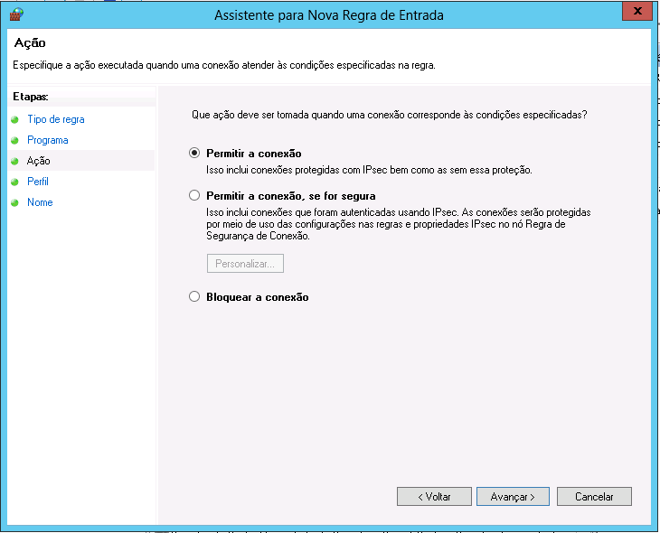
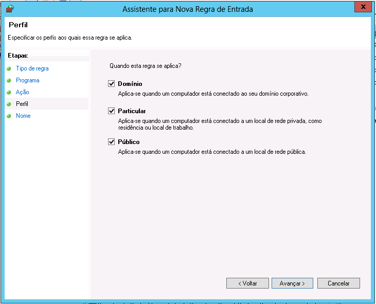
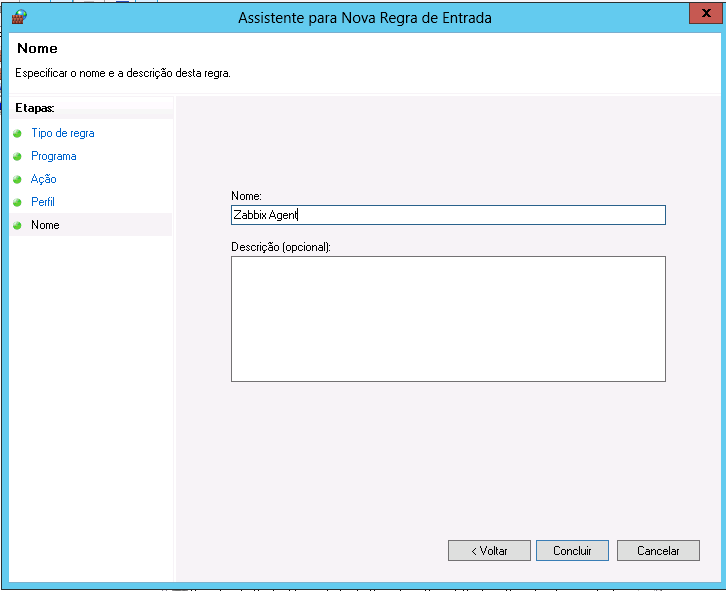

# Liberando Agente Zabbix no Firewall

Para rodar o Agente Zabbix, temos de liberar 3 processos no Firewall do Windows:

*   zabbix_agentd.exe
*   zabbix_sender.exe
*   zabbix_get.exe

Para isso, abra o menu iniciar e procure por `Firewall do Windows` e abra-o. Vá até `Regras de Entrada` e clique em `Nova Regra`

Na primeira página, selecione `Programa` e clique em `Avançar >`

Na segunda página selecione `Este caminho para o programa` e vá até `C:\zabbix\bin\win64\` e selecione `zabbix_agentd.exe`. Clique em `Avançar >`

Na terceira página, selecione `Permitir a conexão` e clique em `Avançar >`

Na quarta página, selecione todas as opções e clique em `Avançar >`

Na última página, coloque como nome `Zabbix Agent` e clique em `Concluir`.

Repita os passos para `zabbix_get.exe` e `zabbix_sender.exe`