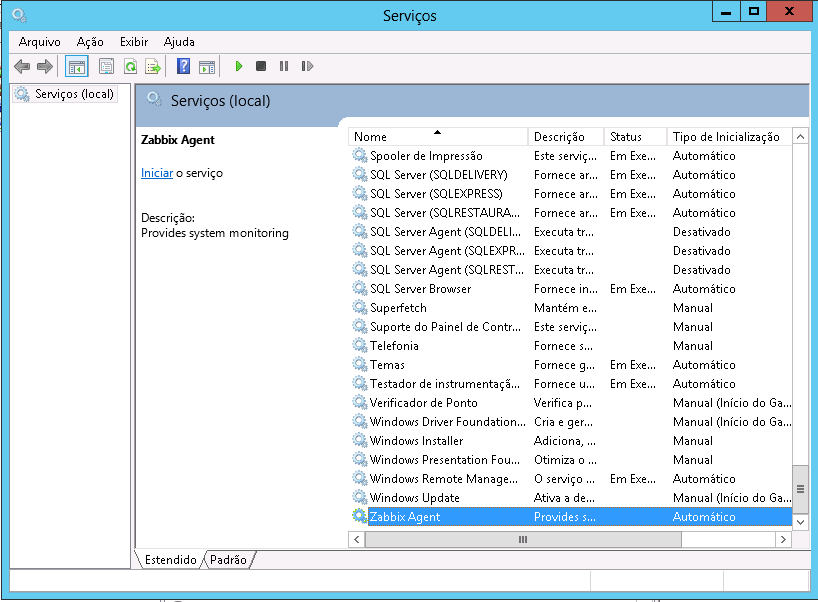

# Rodando Agente Zabbix

Agora podemos rodar o Agente Zabbix. Abra o menu iniciar e procure por `Serviços`. Feito isso vá até o final da lista e procure por Zabbix Agent



Clique em `Iniciar o serviço`.


Feito isso, seu Agente Zabbix está rodando! Para verificar se tudo está OK, vá até o arquivo `C:\zabbix_agentd.log` e veja o seu conteúdo:

```
  3372:20151019:181229.768 Zabbix Agent stopped. Zabbix 2.4.4 (revision 52334).
  2080:20151019:181230.099 Starting Zabbix Agent [ZZZZZZ]. Zabbix 2.4.4 (revision 52334).
  2080:20151019:181230.099 using configuration file: C:\zabbix_agentd.conf
  2080:20151019:181230.100 agent #0 started [main process]
  3480:20151019:181230.100 agent #1 started [collector]
  2076:20151019:181230.100 agent #2 started [listener #1]
  3056:20151019:181230.100 agent #4 started [listener #3]
  3432:20151019:181230.100 agent #3 started [listener #2]
  2776:20151019:181230.100 agent #5 started [active checks #1]
```

Se estiver desta maneira, está tudo certo! Se houver um erro falando que o hostname não existe para Active Checks, é por que não foi criado o hostname no servidor Zabbix (ou o nome está errado), ou por que as configurações ainda não se propagaram ao proxy.